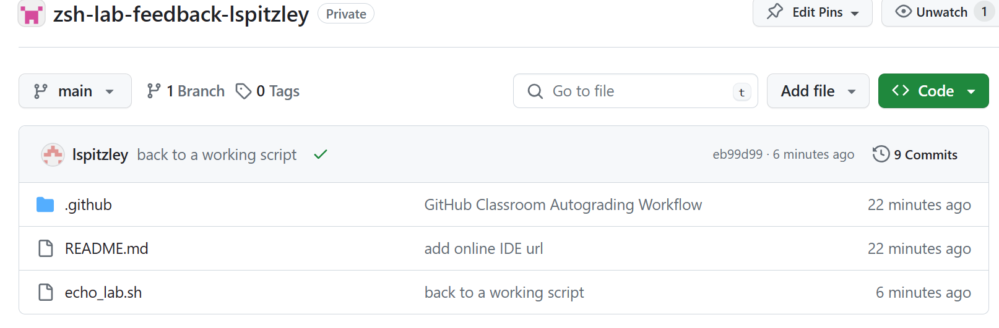

# BFOR 206 Lab
## Class 3-1: Github Setup

# Task Description
Create a Github account (if needed), the create a repository
using Github Classroom. The link to create a repository to work from
is at this link: [https://classroom.github.com/a/vylkpiZd](https://classroom.github.com/a/vylkpiZd].)

This is a place where you commit your work for each day of class. Many lab assignments will
have an autograded test that will run when you commit your work. You will be able to see
the results of the test in the Github Classroom interface. If your tests pass, that means 
you have done the lab correctly. If not, you will need to fix your work and commit again.

# Input
There is no input for this lab.

# Output
There is no output for this lab.

# Submission instructions
Please show the instructor your Github repository
interface with your class repository information.

It should look similar to this:

